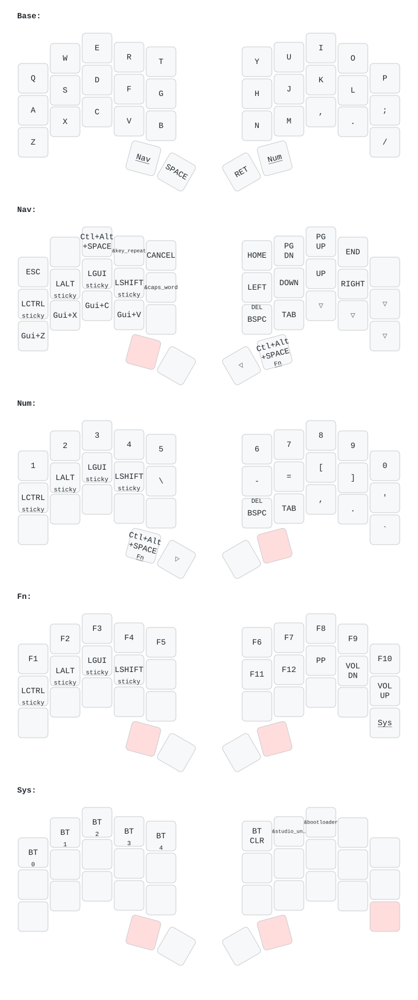

Personal ZMK firmware for the [Urchin keyboard](https://github.com/duckyb/urchin),
forked from [duckyb/urchin-zmk-firmware](https://github.com/duckyb/urchin-zmk-firmware).

The 34-key layout is ported from my X.Tips V4s QMK/Vial keymap.

## Layout

The diagram is redrawn from [`config/urchin.keymap`](config/urchin.keymap) by
[keymap-drawer](https://github.com/caksoylar/keymap-drawer) on every push, so it
always matches the firmware.

- **Base** — QWERTY. Left thumb holds **Nav**, right thumb holds **Num**.
- **Nav** — arrows and paging on the right; Callum-style sticky mods
  (Ctrl/Alt/Gui/Shift) on the left home row; macOS clipboard shortcuts;
  Caps Word and Repeat Key. Shift+Backspace sends Delete.
- **Num** — digits and the symbol row; the same sticky mods on the left home row.
- **Fn** — hold both outer thumb keys. F-row and media, plus the settings row at
  the bottom: Bluetooth profiles 1–5, `BT_CLR`, ZMK Studio unlock, bootloader.
- Tapping the opposite thumb key of Nav/Num (the key that completes the Fn chord)
  sends Ctrl+Alt+Space — the macOS "next input source" shortcut.

## Building & flashing

Push to `main` and GitHub Actions builds the firmware; download the artifact from
the [latest run](../../actions). Double-tap the reset button on a half and copy
the matching `urchin_left.uf2` / `urchin_right.uf2` onto the UF2 drive that
appears.

If the old layout persists after flashing (leftover ZMK Studio state), flash
`settings_reset.uf2` from the same artifact to both halves, then flash normally
and re-pair the keyboard.
